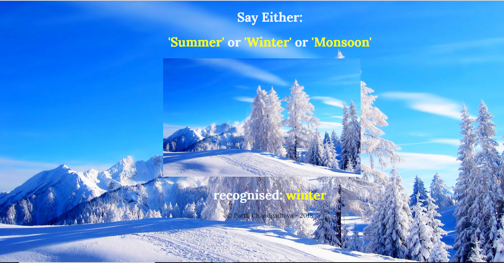
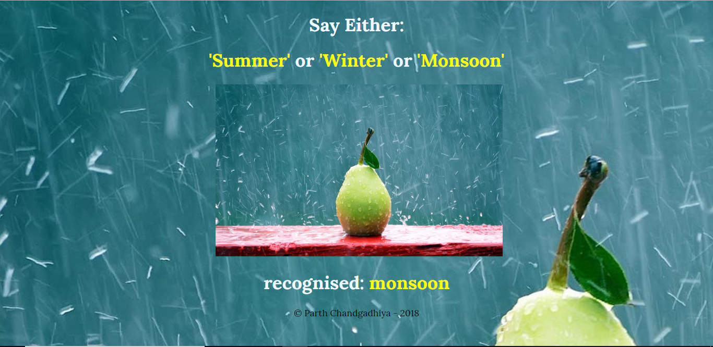

# Season-Changer

Season changer is a voice based JavaScript project which changes season based upon voice input. Season changer has three different seasons ie. monsoon, summer and winter. Each time user utters the name of season the model outputs confidence level, what is processed and changes the season.

## Initial Screen
 

## Screen after syaing "Winter"
 

## Screen after saying "Summer"
 

## Screen after saying "Monsoon"
 
